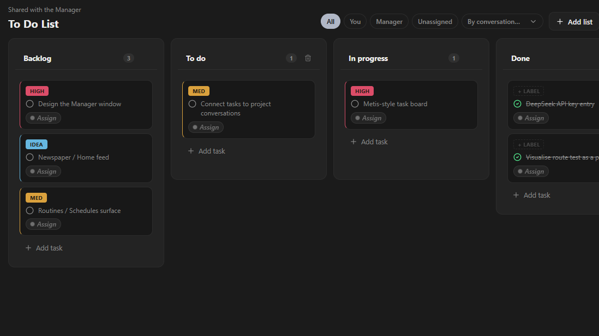
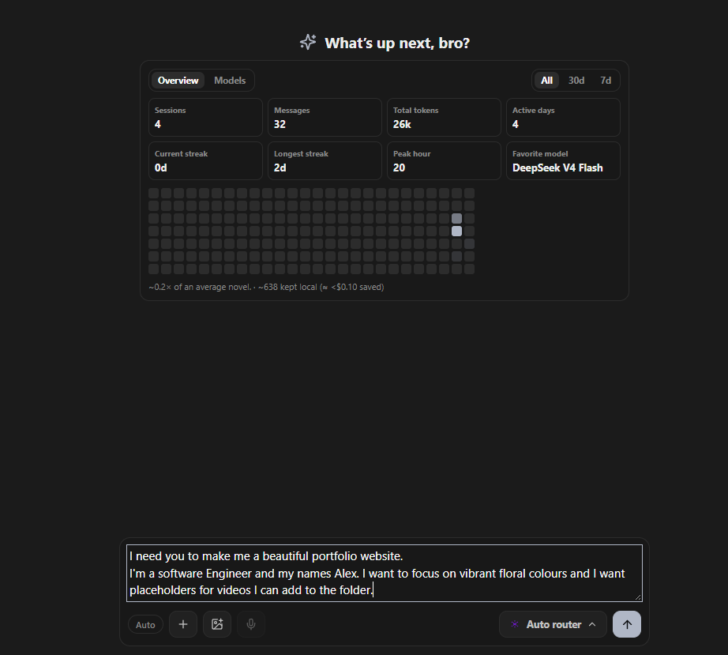
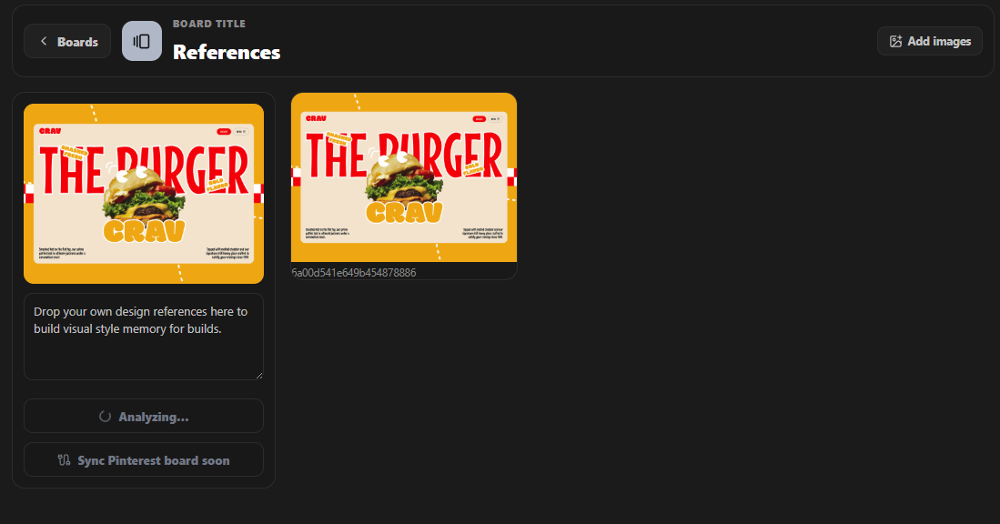
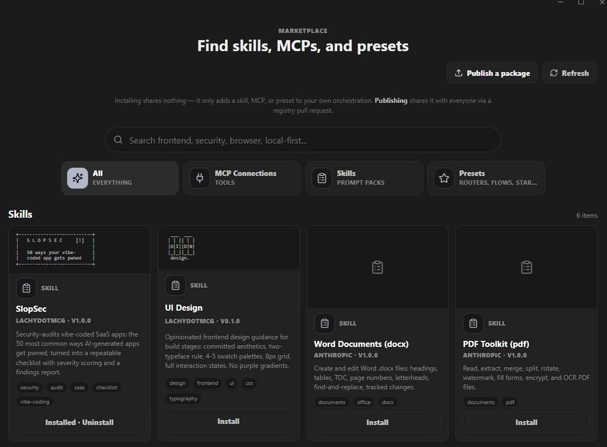
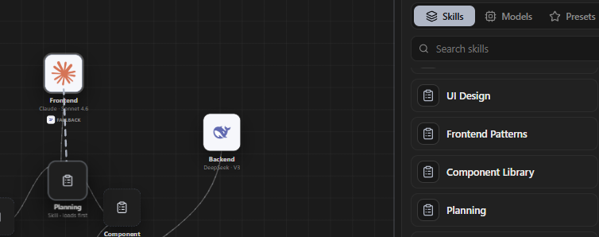
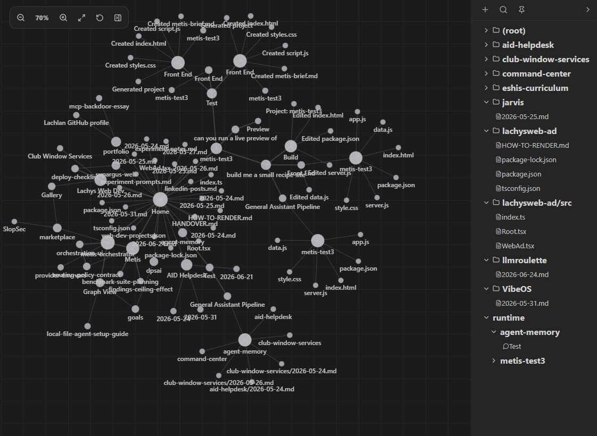
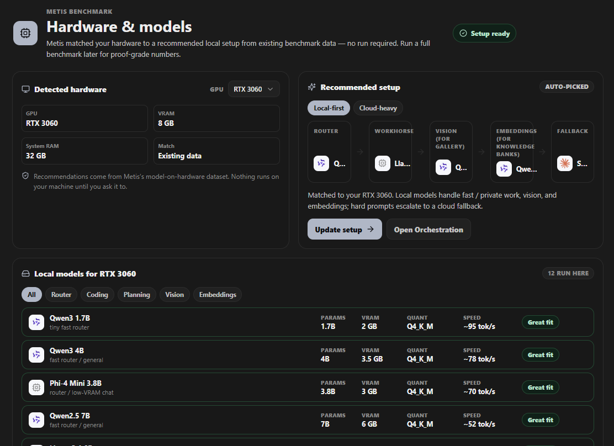

<p align="center">
  
</p>

# Metis Orchestrator

**Orchestration used to be a lab thing. Now it is yours.**

Metis Orchestrator is a local-first AI studio that sends every task to the model that is genuinely best at it. Wire a pipeline on a visual graph, and your planning step, your frontend step, and your logic step can each run on a different model, local or cloud, whichever one actually wins at that job.

Because no single model is best at everything. One plans better, another writes cleaner React, another is dirt cheap and completely fine for the easy stuff. Metis routes each task to the right one for you, so you stop paying flagship prices for work a small local model could do for free.

### What you get

- **Oracle: answers before you finish asking.** Metis's speculative engine reads your prompt as you type, prewarms the model, and drafts the response during your natural pauses. In real-world testing on local models, Oracle cuts time-to-first-token by **4.1x to 9.5x**, and when your prompt is unchanged at send, the fully drafted answer is served instantly. Local-only by default, off by default, one toggle to try it.
- **The best-suited model for every task.** Route by quality and let each stage go to whatever model excels at it, instead of forcing one model to do the whole job.
- **A fraction of the token bill.** Run everything locally for free, or send the easy tasks to cheap models and save the expensive ones for when they earn it.
- **No lock-in, ever.** Bring your own API keys, plug in the OpenRouter subscription you already pay for, or go fully local. Your keys, your models, your machine.
- **Free.** Metis itself costs nothing, and local-first is free forever. That is the whole point.


## The Metis stack

Metis is one story, layer by layer:

- **Metis Benchmark** measures local models: quality x hardware x dollars.
- **Metis Policy** is the routing brain the benchmark proved out.
- **Metis Oracle** is the speculative engine: it prewarms, drafts, and prepares your answer while you are still typing.
- **Metis Orchestrator** (this app) is where all of it runs.

## Feature tour

### The orchestration graph and its router policy
Build a pipeline visually with router, agent, and skill nodes. Each node gets its own model, gateway, and fallback chain, and you can swap the model on any node right in the UI. The router policy is the brain of the whole thing: per-task rules for quality, cost, and quota that decide where each step goes, so easy work lands on a cheap or local model and the hard prompts escalate to the cloud only when they truly need to. Save a policy as a preset, share it, or fire a quick Run Test without a full build.

### The build pipeline
Runs go plan, then frontend, then functional, writing real files into your project folder. Builds verify themselves and self-repair when something is off, and they edit an existing folder in place instead of clobbering it. Every model call gets its own visible side-chat, so you can watch exactly what each stage said.


### Managed agents that work together
Big tasks fan out to a team of named agents that each claim their own files and run in parallel, the way a real team splits up a codebase. They talk to each other over a shared bus with handoffs, questions, and review requests, so two agents editing the same project stay in sync instead of stepping on each other. If you have seen Traycer, it is that idea, except local-first, so running ten agents costs you nothing. The whole thing rides on a harness where an agent can spawn its own sub-agents to go deeper on a piece of work.

### Permission layers you control
You decide how much Metis can do on its own. Permission modes run from ask-me-everything to fully autonomous, and when an action needs a call, a prompt pops up right where you are working with allow-once, always-allow, or deny. Nothing touches your files or the network beyond the level of consent you set.

### The Manager, getting work done while you are away
A built-in manager agent that knows your projects and your to-dos. It turns loose ideas into tasks, can hold conversations on your behalf, gets work moving while you are away, and ticks items off your to-do list as they land. It rides along as a floating widget you can carry anywhere on screen.



### Chat with attachments
Talk to the orchestrator directly. Drop in an image and it routes to a vision-capable model automatically.



### Gallery: reference images that pick themselves
Drop in reference images and Metis describes each one automatically, using your own hardware, then sorts them by what they actually are. At build time the pipeline retrieves the right reference for the job on its own, so your frontend inherits a real look you chose instead of defaulting to generic AI-slop design.



### Marketplace and registry
Every skill and MCP connection you could need, in one place, and the ones your orchestration calls for load automatically. Browse, install, star, and publish skills, MCP connections, and presets, all reviewed and merged by pull request. You can even look at other people's orchestrations and share your own, so the best setups spread instead of staying locked in one person's app. Installing is as simple as it sounds: just drag and drop a skill onto your setup and it is in.





### Knowledge Banks
Local embeddings over your project files and past conversations ground the pipeline's prompts in what is actually there, not just what is in the current chat.

<!-- SCREENSHOT: Knowledge Banks panel -->

### Graph View
A force-directed memory graph backed by a real file directory. Open and edit documents right there in the graph.



### Benchmark onboarding
Hardware-matched local model recommendations, so you are running the right model for your machine from the very start. Installing a model is the same easy move: just drag and drop it and Metis pulls it for you.




### Routines
Scheduled runs for the pipelines you want happening on a timer instead of by hand. Set a routine and Metis fires it for you: a nightly repo tidy, a morning brief, whatever you wire up.

### Community
A feed for what is new across Metis: releases, fresh marketplace packages, and what other people are publishing.

### Settings
Appearance, chat behaviour, providers and API keys, MCP servers, privacy, and an About section with update checks.

### Ctrl+K command palette
Press Ctrl+K (Cmd+K on Mac) from anywhere to search your conversations, jump to any settings section, and switch to any nav view without touching the sidebar.

### Prompt templates in the composer
Slash-command style snippets in the composer turn the prompts you type over and over into a pick instead of a retype.

### Questions from the model, batched and inline
When a run needs to ask you something, up to four questions can rise in a single popup from the chatbox, each with its own option chips or a free-text answer, instead of stopping you one question at a time.

### Installed-model badges in the picker
Local models you have actually pulled are badged apart from the ones that are merely available to install, so you never pin a model you have not downloaded. Saved model presets, if you have any, show up as one-click shortcuts in the same picker.

### Onboarding that gets you running, not just welcomed
First launch walks you through your name, a Local, Cloud, or Hybrid preference, a hardware check with model recommendations, and one-click installs for the picks. You land in the app on a real local profile, BYO (bring-your-own API keys) by default.

### Token usage, right where you are
A per-conversation line shows what that conversation is actually costing, reusing the telemetry Metis already tracks instead of sending you to a separate dashboard.

### Errors panel
A last-errors view fed straight from the audit log, so a crash or failure surfaces in the app instead of sending you spelunking through log files.

### System tray
Metis lives in the tray too: a native icon shows routing status, lets you pause or resume routines, surfaces recent runs, and closes to tray instead of quitting outright.

### Metis Gateway
Point any OpenAI-compatible app, script, or tool at `http://127.0.0.1:11500/v1` with your Metis bearer token, and it gets routed through Metis exactly like a chat composer turn: leave the model as `metis-auto` for the same Auto Router decision, or pin a specific model directly. Loopback-only and off by default, so nothing outside your machine can reach it, and no other local software can call it without your token.

## Getting started

Prerequisites:
- Node 18+ (the repo targets Node 20 in `engines`)
- Optionally, [Ollama](https://ollama.com) for local models, and API keys for any cloud providers you want to use

```bash
npm install
npm run dev     # Vite dev server + Electron, hot-reloading
npm run build   # typecheck, build the renderer, and compile the Electron main process
```

Provider API keys are entered in **Settings > Providers**. Local models come from the Benchmark's install flow, or by running `ollama pull <model>` yourself. Prefer to keep your existing plan? Point Metis at your OpenRouter key and route through the models you already pay for.

## Architecture overview

- **Electron main process** (`src/electron/main.ts`): providers, routing, the build pipeline, and IPC to the renderer.
- **Renderer** (`src/renderer/ui/App.tsx`): React 18 + Vite.
- **Shared contracts** (`src/shared/runtime-contracts.ts`): the types both sides agree on.
- **Registry** ([github.com/lachydotmcg/metis-registry](https://github.com/lachydotmcg/metis-registry)): the model catalog, marketplace packages, and Community feed, served from a separate repo.

## Documentation

- [`docs/ARCHITECTURE.md`](docs/ARCHITECTURE.md) - the contributor-facing map: process model, the run pipeline, the IPC bridge surface, and where to add things.
- [`docs/ORACLE.md`](docs/ORACLE.md) - how the speculative prewarm/draft/serve engine actually works, end to end.
- [`docs/SECURITY.md`](docs/SECURITY.md) - the threat model, permission system, secrets handling, and third-party risk.
- [`docs/PRIVACY.md`](docs/PRIVACY.md) - the plain-language privacy summary.
- [`CONTRIBUTING.md`](CONTRIBUTING.md) - dev setup, project layout, code style, and how a change lands.
- [`docs/RELEASING.md`](docs/RELEASING.md) - how to cut a tagged release.
- [`CHANGELOG.md`](CHANGELOG.md) - what shipped, release by release.
- [`docs/DRILL_PLAN.md`](docs/DRILL_PLAN.md) - the active roadmap.

## Publishing to the marketplace

The in-app Publish wizard generates a manifest for your skill, MCP connection, or preset and opens a pre-filled GitHub pull request against the registry for review. Anything you build stays personal until you publish it: installing is for your own setup, publishing is what makes it shared with everyone else.

## Roadmap

The active plan lives in [`docs/DRILL_PLAN.md`](docs/DRILL_PLAN.md), with feature designs in [`docs/FABLE_PLANS.md`](docs/FABLE_PLANS.md).

## Status

Pre-release and moving fast. Built by Lachy, solo founder, with an AI coordinator and implementer workflow.
