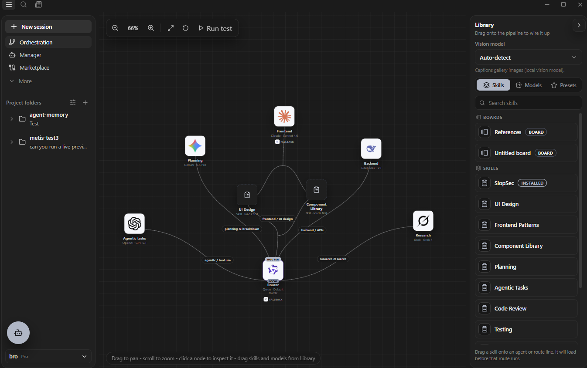
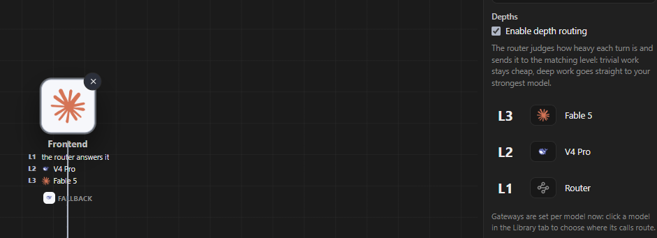
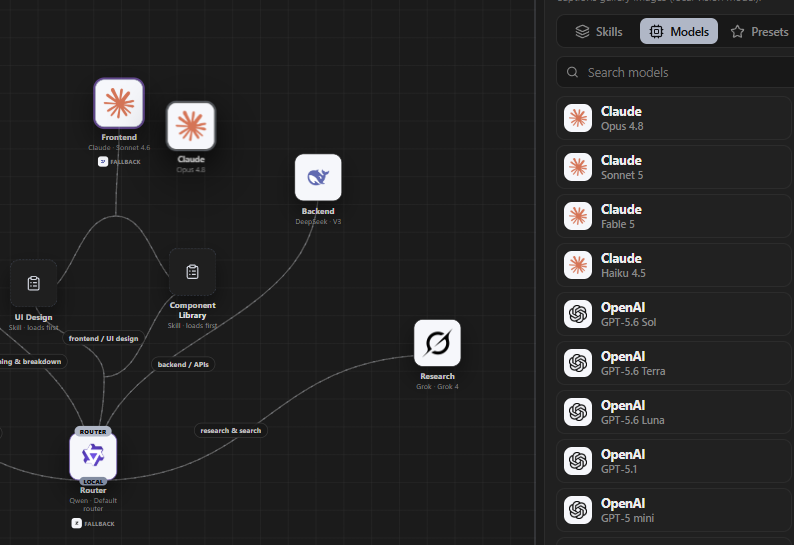
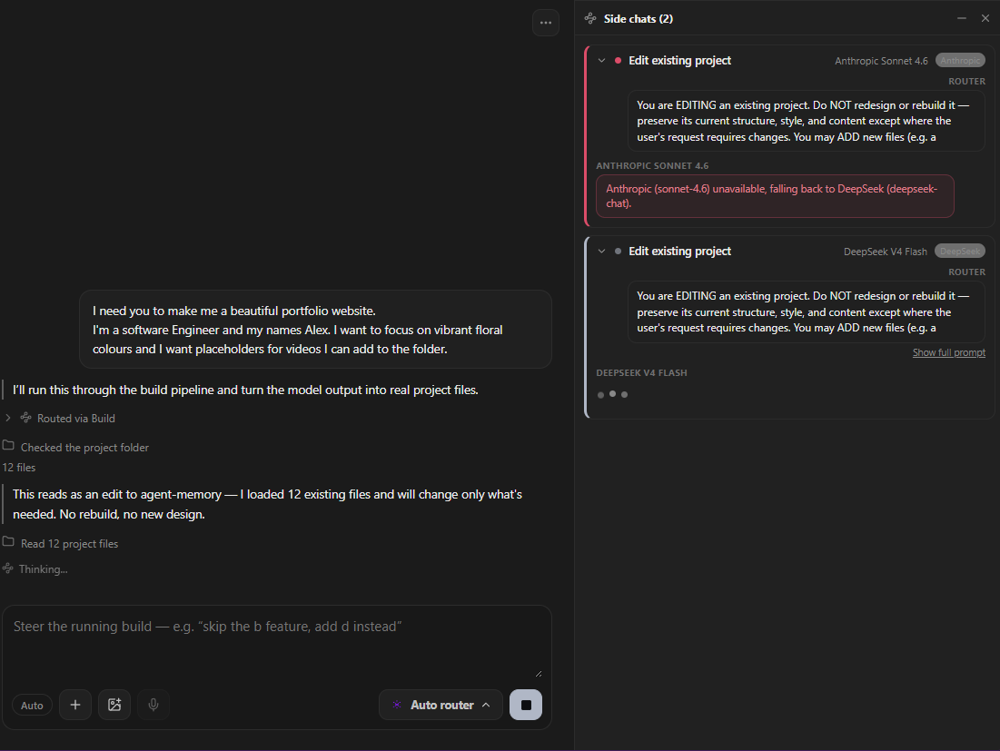

<p align="center">
  
</p>

# Metis Orchestrator

**Every model you have, on one canvas, doing the part it is actually best at!**

Inside a frontier lab, nobody sends every request to one model. They route: a cheap fast model for the easy parts, a strong expensive one for the hard reasoning, a specialist for the frontend, all wired into a pipeline someone designed on purpose. That control is most of why lab output is good, and it is the part you never get handed. Every AI app you can download is a box that picks for you.

Metis gives you the wiring. You decide which model plans, which one writes the frontend, which one makes it work, which one you never send private code to. Drag them onto the canvas and connect them. Then point it at a real folder and it writes real files.

And routing by task is only half of it. Turn on Depths and every node becomes a ladder rather than a model: the router judges how heavy each individual turn is and sends it to the matching rung. Trivial work stays on something cheap or local, and only the genuinely hard turns reach your strongest model. Two questions instead of one, "what kind of work is this" and "how hard is this particular piece of it".

**The whole point is to give you the best results, the fastest, and the cheapest.** Best, because a task routed to the right model beats the same task sent to whatever a vendor picked for you. Fastest, because Oracle drafts your answer while you are still typing and can serve it the instant you hit enter. Cheapest, because nothing expensive gets spent on work that did not need it.

It runs on your machine, on your keys, with no account and no server of ours in the path. Local models are free to run, so the cheap parts genuinely cost nothing.

<p align="center">
  
</p>

<p align="center">
  <em>A local Qwen router at the centre, deciding. Gemini plans, Claude does the frontend, DeepSeek does the backend,<br />GPT takes agentic work, Grok does research. Every route is labelled, and every one of those choices is yours.</em>
</p>

<p align="center">
  
</p>

<p align="center">
  <em>Depths, switched on. The node stops being one model and becomes three rungs: here L1 is answered by the router itself,<br />L2 goes to V4 Pro, and only the hardest turns reach Fable 5. Opt-in, and off until you enable it.</em>
</p>

<p align="center">
  
</p>

<p align="center">
  <em>Changing your mind is a drag. Here Opus 4.8 is being dropped onto the Frontend node to replace Sonnet 4.6.</em>
</p>

<p align="center">
  
</p>

<p align="center">
  <em>A run in progress. It read the 12 files already in the folder, decided this was an edit rather than a rebuild, and said so.<br />On the right, Anthropic went unavailable mid-stage and DeepSeek picked it up. You can watch the fallback happen.</em>
</p>

<sub>Screenshots predate the v1 navigation cut, so the sidebar shows a few entries that are hidden in v1. The marker table under "What it does" explains the rest.</sub>
---

## What it does

v1 navigation is exactly four items: New session, Orchestration, Benchmark, Settings. Everything below is real code in this repo. The marker says how real: **VERIFIED** has a recorded run behind it, **SHIPPED** works when driven by hand, **FLAG OFF** is built but defaults to off, **PLANNED** is designed and not built. Full detail on any of them, including the honest limits, is in [`docs/FEATURES.md`](docs/FEATURES.md).

**Use it today:**

| | |
| --- | --- |
| **Chat and the Auto Router** `SHIPPED` | Type a prompt, Metis picks a model you actually have installed. |
| **The orchestration build pipeline** `VERIFIED` | Plan, then front end, then make it functional, writing real files. |
| **The snapshot safety net** `VERIFIED` | Every generated write is backed up first, or it does not happen. |
| **Metis Loops** `VERIFIED` | Hand it a goal and it works across several turns, deciding each turn whether to continue. |
| **The CLI harness** `VERIFIED` | Drive the real pipeline headlessly and assert on the result. |
| **Permissions, five modes** `SHIPPED` | You pick how much Metis may do on its own, per run. |
| **Providers and fallback chains** `SHIPPED` | Your keys, your models, and a route that survives one going down. |
| **Local-first, bring your own keys** `SHIPPED` | No account, no telemetry, no server of ours in the path. |
| **Knowledge banks** `SHIPPED` | Local embeddings over your project files, grounding answers in what is really there. |
| **Onboarding and the Benchmark** `SHIPPED` | Hardware-matched local model picks before you are dropped into the app. |

**Turn it on when you want it** (all default to off):

| | |
| --- | --- |
| **Oracle** `FLAG OFF` | Drafts your answer while you are still typing, and can serve it the instant you hit enter. |
| **Depths** `FLAG OFF` | Routes each turn by how hard it is, so trivial work stays cheap. |
| **Agentic tools** `FLAG OFF` | Lets a model read and edit your files instead of guessing at them. |
| **Metis Gateway** `FLAG OFF` | A local OpenAI-compatible endpoint, so any tool can borrow Metis's routing. |
| **MCP, both directions** `FLAG OFF` | Metis can call MCP tools, and be an MCP server. |
| **Multi-agent fan-out** `FLAG OFF` | A build splits across named sub-agents, each claiming its own files. |
| **Model-driven routing** `FLAG OFF` | Let a model do the classifying instead of keyword rules. |
| **Quick-ask and headless start** `FLAG OFF` | Ask from anywhere, or run with no window. |

**Designed, not built yet:**

| | |
| --- | --- |
| **Flowchart Loops** `PLANNED` | A loop given ordered steps: `/loop --steps "read -> plan -> implement"`. Design in [`docs/FLOWCHART_LOOPS_DESIGN.md`](docs/FLOWCHART_LOOPS_DESIGN.md). |

Built and complete but not reachable from v1's four-item navigation: Manager, Marketplace, Routines, Gallery, Graph View, the Community feed, and two Settings sections. Un-hiding any of them is deleting a string from one `Set`. Why each is held back is in [`docs/FEATURES.md`](docs/FEATURES.md).


---

## Getting started

Prerequisites:

- **Node 20 or newer** (`engines` requires `>=20`).
- **[Ollama](https://ollama.com)**, strongly recommended. Metis is local-first, and without either a pulled local model or a cloud key configured there is nothing for the router to route to. `doctor` will tell you exactly that.
- Cloud provider API keys are **not** environment-only. They are entered at runtime under **Settings > Providers**.

```bash
git clone https://github.com/lachydotmcg/metis-orchestrator.git
cd metis-orchestrator
npm install
npm run dev
```

`npm run dev` starts Vite on `127.0.0.1:5177`, waits for it, compiles the Electron main process, and launches the app against that dev server. The renderer hot-reloads through Vite. A change under `src/electron` needs a restart.

Pull a local model before your first run:

```bash
ollama pull qwen3:8b
ollama pull nomic-embed-text   # knowledge banks and Oracle near-match both need this
```

Then check the environment without running anything:

```bash
npm run cli -- doctor
```

Other scripts you will actually use:

| Script | What it does |
| --- | --- |
| `npm run dev` | Vite plus Electron, hot-reloading renderer. The everyday loop. |
| `npm run build` | `typecheck`, then the renderer build, then the Electron main process. This is the gate that has to pass. |
| `npm run typecheck` | Types only, both trees, no output written. |
| `npm start` | `build` then `electron .`, a production-mode launch. |
| `npm run cli -- <subcommand>` | The headless harness. See the CLI section above. |
| `npm run dist` | Full build plus installers under `release/`. |

There is no separate lint script and there are no tests. `typecheck`, `build`, and the CLI harness are the gates.

---

## Where to read more

| | |
| --- | --- |
| [`docs/FEATURES.md`](docs/FEATURES.md) | Every feature in depth, with its honest limits. The long version of the table above. |
| [`docs/ROADMAP.md`](docs/ROADMAP.md) | What is coming and in roughly what order, with what is merely hidden marked as such. |
| [`docs/LIMITATIONS.md`](docs/LIMITATIONS.md) | What Metis does not do yet, kept current. Closed items are struck through rather than deleted, so it doubles as a record of what got fixed. |
| [`docs/ARCHITECTURE.md`](docs/ARCHITECTURE.md) | How the pieces fit, and the IPC table. Start here to contribute. |
| [`docs/ORACLE.md`](docs/ORACLE.md) | The speculative inference writeup. |
| [`docs/LOOPS.md`](docs/LOOPS.md) | The Loops design and what shipped versus what did not. |
| [`docs/SECURITY.md`](docs/SECURITY.md) | Threat model, permission gates, and path containment. |
| [`docs/MCP_SERVER.md`](docs/MCP_SERVER.md) | Pointing an MCP client at your running Metis. |

## Status

One person building in the open. The core is real: it routes, it writes files into folders you
choose, it backs up what it touches, and it can be handed a goal it works on by itself.

Two things a sceptical reader should know. There are no automated tests in this repo, so
`npm run typecheck`, `npm run build`, and the CLI harness are the gates that actually run. And the
`v1.0.0` tag predates almost everything described here, which is all on `main` and not yet tagged.

Everything else worth knowing before you rely on it is in
[`docs/LIMITATIONS.md`](docs/LIMITATIONS.md).
